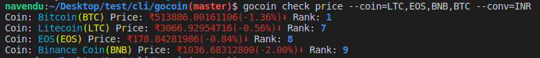
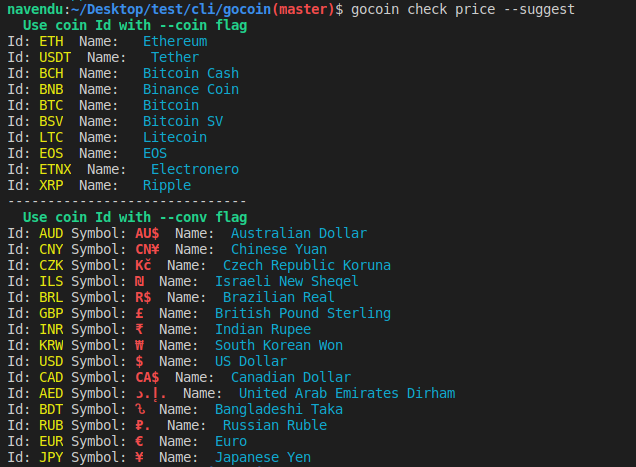

## Run

* clone the repository
```bash
git clone https://github.com/NavenduDuari/gocoin
```

* compile and install the package
```bash
cd gocoin
go install github.com/NavenduDuari/gocoin
```

* execute command
```bash
gocoin --help
```
## Key Configuration
#### Get a key
* [click here](https://p.nomics.com/cryptocurrency-bitcoin-api) to get API key from nomics.com

#### Set the key
```bash
gocoin key --set yourApiKey
```

## Screenshot


